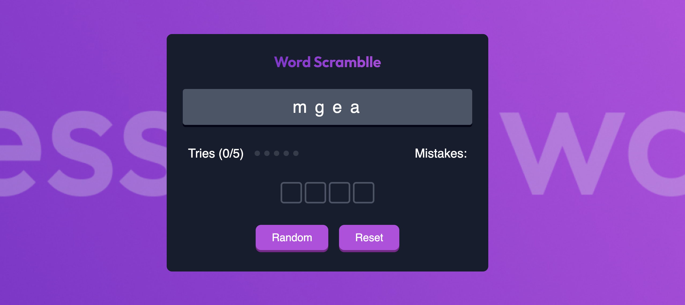

# 🎮 Guess The Word Game

A fun, interactive word puzzle game built using vanilla JavaScript, HTML, and CSS. In this game, players are shown a **scrambled word** and must guess the correct word by typing one letter into each input box.



---

## 📌 Features

- Randomly scrambled words from a predefined list
- Intuitive UI with input boxes for each letter
- Tries and mistakes tracking (with a max of 5 tries)
- Visual dot indicators for remaining tries
- Success and failure messages
- Responsive design for mobile and desktop
- Reset and Play Again functionality

---

## 🕹️ How to Play

1. Click the **"Random"** button to start a new game with a scrambled word.
2. You will see input boxes — one for each letter of the original word.
3. Type your guess letter-by-letter into each box.
4. **Correct letters turn green**, incorrect ones turn red.
5. You have **5 total tries** — each wrong guess consumes a try.
6. The game shows your current tries and mistakes made so far.
7. If you guess all letters correctly, you win! 🎉  
   If you use all 5 tries, it's game over.
8. Use the **"Reset"** button to clear your inputs and try again with the same word.
9. Click **"Play Again"** to load a new scrambled word.

---

## 🧩 Word List

The current word pool includes:

example, find, newbie, challange, renu, sadikshya, game

You can update the list inside the JavaScript array:

```js
const gameWords = [
  "example",
  "find",
  "newbie",
  "challange",
  "renu",
  "sadikshya",
  "game",
];
```

## 🙋‍♂️ Author

- Prabin Regmi
- This game was created as a fun and educational project to practice DOM manipulation and interactive UI design.
